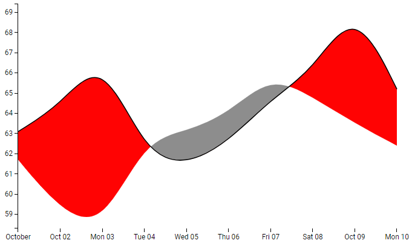

# Difference chart



This is a mod example demonstrating a difference chart written in `TypeScript`, rendered with `d3` and bundled with `Webpack`.

All source code for the mod example can be found in the `src` folder. Other necessary files reside in the `static` folder. Read below for further explanation.

## Prerequisites

These instructions assume that you have [Node.js](https://nodejs.org/en/) (which includes npm) installed.

## How to get started (with development server)

- Open a terminal at the location of this example.
- Run `npm install`. This will install necessary tools. Run this command only the first time you are building the mod and skip this step for any subsequent builds.
- Run `npm start`. This will compile TypeScript to JavaScript and place the bundle in the `dist` folder. This task will watch for changes in code and will continue running until it is stopped. Whenever you save a file, the changes will be reflected in the visualization mod.
- Run `npm run server` in a separate terminal. This will start a development server.
- Start editing, for example `src/main.ts`.
- In Spotfire, follow the steps of creating a new mod and connecting to the development server.

## Working without a development server

- Open a terminal at the location of this example.
- Run `npm install`. This will install necessary tools. Run this command only the first time you are building the mod and skip this step for any subsequent builds.
- Run `npm run build`. This will bundle the JavaScript and place it in the `dist` folder. It also copies the contents of `static` into `dist`. This task will not watch for changes in code.
- In Spotfire, follow the steps of creating a new mod and then browse for, and point to, the _manifest_ in the `dist` folder.

## Data requirements

- Use this data set for testing and debuging. Simply copy and paste into spotfire and use X, Y1 and Y2 respectiveley:
```
date, NY, SF
2011-10-01,63.1,61.7
2011-10-02,64.4,59.2
2011-10-03,66.9,58.3
2011-10-04,62,62.7
2011-10-05,61.4,63.1
2011-10-06,62.6,64
2011-10-07,64.7,65.9
2011-10-08,66.1,64.8
2011-10-09,69.4,63.5
2011-10-10,65.2,62.4
```

## Example Data
- Use the provided DifferenceChart.dxp for demo


## Current development status
 - The DifferenceChart was ported from [here](]https://codepen.io/jleviaguirre/pen/MWXxWOm) and implemented directly on the [Sunburst Chart Mod](https://github.com/TIBCOSoftware/spotfire-mods/tree/master/catalog/sunburst-chart) example and removing irrelevant code
 - Marking is yet to be implemented and should work similarly as teh [Area Chart Mod](https://github.com/TIBCOSoftware/spotfire-mods/tree/master/examples/js-areachart-d3)
